**🚀 POO en Java - Curso SENATI**

  

---

## 📚 Descripción

Este repositorio contiene ejercicios y ejemplos prácticos de **Programación Orientada a Objetos (POO)** en Java, desarrollados en el curso vacacional de Java en **SENATI**. Aprenderás a modelar clases, gestionar relaciones en paquetes, aplicar modificadores de acceso y crear una sencilla interfaz gráfica con **Java Swing**.

## 🎯 Objetivos de Aprendizaje

- Comprender y aplicar los **fundamentos de POO**: clases, objetos, atributos y métodos.
- Usar **modificadores de acceso** (private, default, protected, public) correctamente.
- Implementar **relaciones**: herencia, composición y asociación.
- Explorar **polimorfismo** y **abstracción** con interfaces y clases abstractas.
- Diseñar una **GUI básica** con Java Swing.

## ⚙️ Tecnologías y Herramientas

- **Java 11** (o superior)
- IDE: **NetBeans** o **Eclipse**
- Sistema de construcción: **Maven**
- Control de versiones: **Git**

## 🗂 Estructura del Proyecto

```
poo-java-senati/
├── pom.xml
└── src/main/java/
    ├── uno/             # Paquete 1: acceso dentro de mismo paquete
    │   ├── ClaseA.java  # Atributos con distintos modificadores
    │   └── ClaseB.java  # Acceso a ClaseA en mismo paquete
    ├── dos/             # Paquete 2: herencia y acceso entre paquetes
    │   ├── ClaseC.java  # Hereda de ClaseA
    │   └── ClaseD.java  # Accede a miembros públicos de ClaseA
    └── view/            # Interfaz gráfica con Swing
        └── PedidoView.java
```

## 📋 Diagrama de Clases

```mermaid
classDiagram
    direction LR
    
    class ClaseA {
        - int n1    : privado
        ~ int n2    : default
        # int n3    : protegido
        + int n4    : público
        + ClaseA()
        + void mostrarA()
    }
    class ClaseB {
        + void mostrarB()
    }
    class ClaseC {
        + void mostrarC()
    }
    class ClaseD {
        + void mostrarD()
    }
    ClaseA <|-- ClaseC : hereda
    ClaseB --> ClaseA : usa
    ClaseC --> ClaseA : usa
    ClaseD --> ClaseA : usa
```



> **Notas**:
>
> - *ClaseC* accede a `n3` (protected) por herencia.
> - *ClaseD* solo puede usar el miembro `n4` (public).

## 🛠 Instalación y Ejecución

1. Clonar el repositorio:
   ```bash
   ```

git clone [https://github.com/tu-usuario/poo-java-senati.git](https://github.com/tu-usuario/poo-java-senati.git)

````
2. Importar como proyecto **Maven** en NetBeans o Eclipse.
3. Compilar y ejecutar los tests de ejemplo:
   - `uno.prueba01`: acceso completo en mismo paquete.
   - `dos.prueba03`: acceso protegido via herencia.
   - `dos.prueba04`: acceso público desde otro paquete.
4. Para la GUI:
   - Ejecutar `view.PedidoView`.

## ✅ Casos de Prueba y Resultados
| Clase de Prueba | Salida Esperada               |
|-----------------|-------------------------------|
| prueba01        | n1=20, n2=30, n3=40, n4=50    |
| prueba02        | n2=30, n3=40, n4=50           |
| prueba03        | n3=40, n4=50                  |
| prueba04        | n4=50                         |

## 🔍 Ejemplos de Código Mejorado

### ClaseA.java
```java
package uno;

/**
 * Representa una clase de ejemplo con distintos modificadores de acceso.
 */
public class ClaseA {
    private int n1 = 20;
    int n2 = 30;              // default
    protected int n3 = 40;
    public int n4 = 50;

    public ClaseA() {}

    /** Muestra valores internos */
    public void mostrarA() {
        System.out.printf("n1=%d, n2=%d, n3=%d, n4=%d\n", n1, n2, n3, n4);
    }

    // Getters y Setters si fueran necesarios
}
````

### ClaseC.java (Herencia)

```java
package dos;

import uno.ClaseA;

/**
 * Hereda de ClaseA para demostrar acceso protected.
 */
public class ClaseC extends ClaseA {
    public void mostrarC() {
        // Acceso a n3 por herencia
        System.out.printf("n3=%d, n4=%d\n", n3, n4);
    }
}
```

### PedidoView\.java (Swing)

```java
package view;

import javax.swing.*;
import java.awt.*;

/**
 * Formulario simple para gestión de pedidos.
 */
public class PedidoView extends JFrame {
    private JTextField tfCliente;
    private JButton btnEnviar;

    public PedidoView() {
        super("Gestión de Pedidos");
        initComponents();
        configurarVentana();
    }

    private void initComponents() {
        tfCliente = new JTextField(20);
        btnEnviar = new JButton("Enviar Pedido");

        JPanel panel = new JPanel(new GridBagLayout());
        GridBagConstraints c = new GridBagConstraints();
        c.insets = new Insets(5,5,5,5);

        c.gridx = 0; c.gridy = 0; panel.add(new JLabel("Cliente:"), c);
        c.gridx = 1; panel.add(tfCliente, c);
        c.gridx = 0; c.gridy = 1; c.gridwidth = 2; panel.add(btnEnviar, c);

        add(panel);
    }

    private void configurarVentana() {
        setDefaultCloseOperation(JFrame.EXIT_ON_CLOSE);
        pack();
        setLocationRelativeTo(null);
    }

    public static void main(String[] args) {
        SwingUtilities.invokeLater(() -> new PedidoView().setVisible(true));
    }
}
```

## 📄 Licencia

Este proyecto está bajo la licencia MIT. Consulta el archivo [LICENSE](LICENSE) para más detalles.

